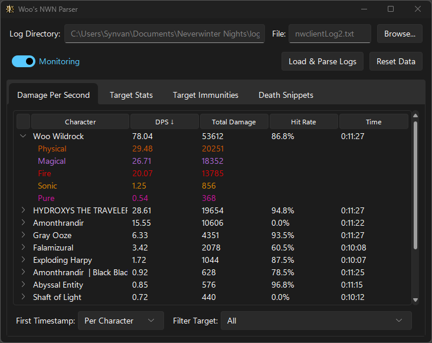
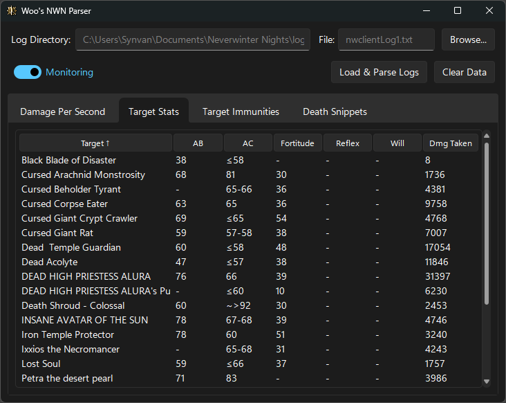
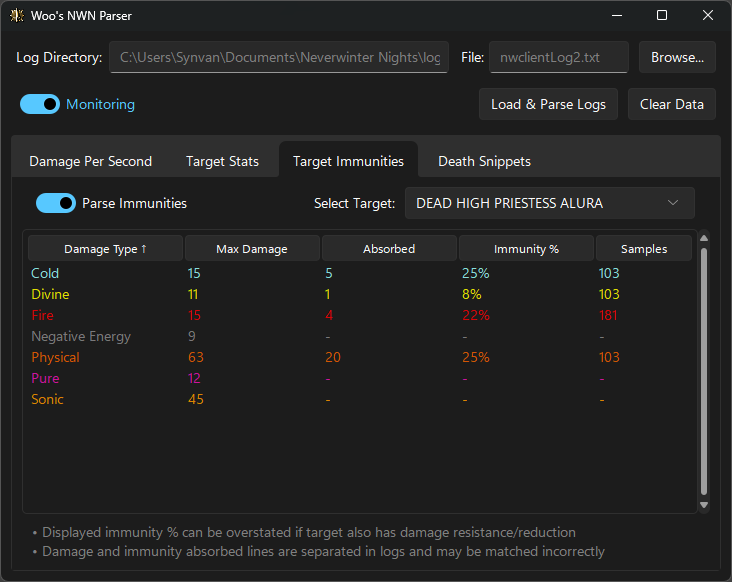

# Woo's NWN Parser

A real-time combat log parser and DPS analyzer for Neverwinter Nights. Track your damage output, analyze attack statistics, monitor enemy immunities, and optimize your combat performance.


## Screenshots

<!-- TODO: Add screenshots -->
**Main Window - DPS Tracking:**



**Target Statistics Panel:**



**Immunity Analysis:**



## Features

### Core Functionality
- **Real-time DPS Tracking** - Monitor damage output per second for all characters
- **Target Statistics** - Track AC (Armor Class), AB (Attack Bonus), and saves for enemies
- **Immunity Detection** - Automatically detect and calculate damage immunities

### Advanced Features
- **Multi-Character Support** - Track all party members simultaneously
- **Damage Type Breakdown** - Detailed analysis by damage type (Physical, Fire, Cold, etc.)
- **Hit Rate Analysis** - Track attack success rates per character
- **Time Tracking Modes** - Track globally from first character action or isolate by character
- **Target Filtering** - Focus analysis on specific enemies

### Technical Features
- **Automatic Truncation Detection** - Handles game restarts and log file resets
- **Immunity Queuing** - Intelligent matching of damage and immunity events
- **Thread-Safe Storage** - Concurrent data access without conflicts

## Quick Start

### Installation

#### Option 1: Download Pre-built Executable (Recommended)
1. Download the latest `WoosNwnParser.exe` from [Releases](../../releases)
2. Place in any folder
3. Run `WoosNwnParser.exe`
4. The app will automatically find your NWN log files

#### Option 2: Run from Source
```bash
# Clone the repository
git clone https://github.com/yourusername/woos-nwn-parser.git
cd woos-nwn-parser

# Create virtual environment
python -m venv venv
venv\Scripts\activate  # On Windows
# source venv/bin/activate  # On Linux/Mac

# Install dependencies
pip install -r requirements.txt

# Run the application
python -m app
```

### Configuration

The parser works out-of-the-box with default NWN installations. If needed:

- **Log Directory**: Defaults to `%USERPROFILE%\Documents\Neverwinter Nights\logs`
- **Target Filter**: Optional - filter to show damage dealt to a specific target only
- **Immunity Parsing**: Toggle parsing of immunity events (disabled by default for leaner parsing)
- **DPS Time Tracking Mode**: Choose between `By Character` (default) or `Global` time tracking

## User Guide

### Understanding DPS Tracking

**By Character Mode** (Default)
- Each character's DPS is calculated from their first damage event
- Best for analyzing individual performance
- Shows "character time" for each participant

**Global Mode**
- All DPS calculated from the earliest damage event
- Best for comparing party member across same time period
- Shows unified timeline

### Reading Target Statistics

**AC (Armor Class)**
- Shows estimated AC based on attack rolls
- Format: `AC: 45` (exact) or `AC: 45-48` (range)
- Natural 1 misses are excluded from calculations

**AB (Attack Bonus)**
- Shows highest detected attack bonus
- Format: `AB: +25` or `AB: Unknown`
- Updated as higher bonuses are observed

**Saves**
- Tracks Fortitude, Reflex, and Will saves
- Shows highest detected value for each

### Immunity Analysis

**Immunity Percentage**
- Automatically calculated from damage and absorption
- Shows as `Fire: 50%`, `Cold: 75%`, etc.
- Uses reverse calculation of NWN damage reduction formula

**Max Values**
- `Max Dmg`: Highest damage of this type dealt to target
- `Max Imm`: Highest immunity points absorbed
- `%`: Calculated immunity percentage

## Architecture

### Project Structure

```
woos-nwn-parser/
├── app/                           # Main application code
│   ├── __init__.py
│   ├── __main__.py                # Entry point
│   ├── models.py                  # Data models
│   ├── parser.py                  # Log parsing logic
│   ├── storage.py                 # Data storage and queries
│   ├── monitor.py                 # File monitoring and rotation
│   ├── utils.py                   # Utility functions
│   ├── assets/                    # Application resources
│   ├── services/
│   │   ├── __init__.py
│   │   ├── dps_service.py         # DPS calculations
│   │   └── queue_processor.py     # Event processing
│   └── ui/
│       ├── __init__.py
│       ├── main_window.py         # Main application window
│       ├── formatters.py          # Data formatting utilities
│       └── widgets/               # UI components
│           ├── __init__.py
│           ├── dps_panel.py
│           ├── target_stats_panel.py
│           ├── immunity_panel.py
│           └── debug_console_panel.py
├── tests/                         # Test suite
│   ├── unit/                      # Unit tests
│   ├── integration/               # Integration tests
│   ├── e2e/                       # End-to-end tests
│   └── fixtures/                  # Test data
├── docs/                          # Documentation
├── WoosNwnParser.spec             # PyInstaller build spec
├── requirements.txt
├── requirements-dev.txt
├── CHANGELOG.md
└── README.md
```

### Key Components

**LogParser** (`parser.py`)
- Parses NWN combat log lines using regex patterns
- Extracts damage, attacks, saves, and immunity events
- Supports player filtering and immunity parsing toggles

**DataStore** (`storage.py`)
- Thread-safe SQLite-based storage
- Tracks damage events, attacks, DPS data, and immunities
- Provides query methods for UI components

**LogDirectoryMonitor** (`monitor.py`)
- Watches NWN logs directory for changes
- Handles log rotation (nwclientLog1.txt → nwclientLog2.txt, etc.)
- Detects file truncation from game restarts

**QueueProcessor** (`services/queue_processor.py`)
- Routes parsed events to appropriate handlers
- Buffers damage for immunity matching
- Manages cleanup of stale immunity queue entries

**DPSCalculationService** (`services/dps_service.py`)
- Calculates DPS with configurable time tracking modes
- Supports target filtering
- Provides damage type breakdowns

## Testing

The project includes a comprehensive test suite with **225 tests** achieving **54% code coverage**.

### Running Tests

```bash
# Install test dependencies
pip install pytest pytest-cov

# Run all tests
pytest tests/unit tests/integration tests/e2e

# Run with coverage report
pytest tests/unit tests/integration tests/e2e --cov=app --cov-report=html

# Run specific test file
pytest tests/unit/test_parser.py -v

# Run tests matching a pattern
pytest -k "damage" -v
```

## Development

### Prerequisites

- Python 3.12 or higher
- Windows 10/11 (for the full UI experience)
- Neverwinter Nights (Enhanced Edition)

### Setting Up Development Environment

```bash
# Clone repository
git clone https://github.com/yourusername/woos-nwn-parser.git
cd woos-nwn-parser

# Create virtual environment
python -m venv venv
venv\Scripts\activate

# Install dependencies
pip install -r requirements.txt

# Install development dependencies
pip install pytest pytest-cov

# Run tests
pytest tests/unit tests/integration tests/e2e -v

# Run application
python -m app
```

### Building Executable

The project uses [PyInstaller](https://pyinstaller.org/) for creating standalone executables:

```bash
# Install PyInstaller & Pyarmor
pip install pyinstaller pyarmor

# Obfuscate the 'app' folder
pyarmor gen --output obfuscated app

# Build executable
pyinstaller --clean WoosNwnParser.spec

# Output: WoosNwnParser.exe
```

## Requirements

### Runtime Dependencies

```
tkinter (included with Python)
sv-ttk>=2.0.0        # Dark theme support
```

### Development Dependencies

```
pytest>=7.0.0
pytest-cov>=4.0.0
pyarmor>=9.2.3			# Obfuscate code for less AV false positives
pyinstaller>=6.17.0		# For building executable
```

## Troubleshooting

### Parser Not Detecting Logs

**Issue**: Parser doesn't find NWN log files

**Solutions**:
- Verify NWN is installed and has been run at least once
- Check logs directory: `%USERPROFILE%\Documents\Neverwinter Nights\logs`
- Ensure combat logging is enabled in NWN (it's off by default):
	- `Game Options` → `Game` → `Game Log Chat All` → Enable
- Check Debug Console panel for error messages

### No DPS Showing

**Issue**: Combat events parsed but no DPS displayed

**Solutions**:
- Ensure you've dealt damage (attacks alone won't show DPS)
- Check that the correct target is selected
- Verify refresh mode matches your needs (`By Character` vs `Global`)
- Clear data and restart if needed (`Reset Data` button)

## License

This project is licensed under the MIT License - see the [LICENSE](LICENSE) file for details.

## Acknowledgments

- Built for the NWN:EE [ADOH](https://www.adawnofheroes.org/) community
- Uses [sv-ttk](https://github.com/rdbende/Sun-Valley-ttk-theme) for modern dark theme

## Links

- **Repository**: [GitHub](https://github.com/yourusername/woos-nwn-parser)
- **Issues**: [Bug Reports](https://github.com/yourusername/woos-nwn-parser/issues)
- **Releases**: [Downloads](https://github.com/yourusername/woos-nwn-parser/releases)
