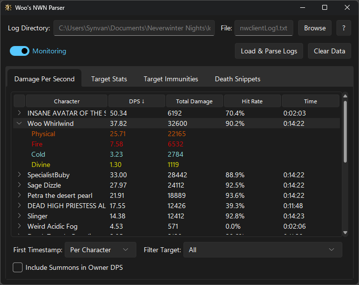
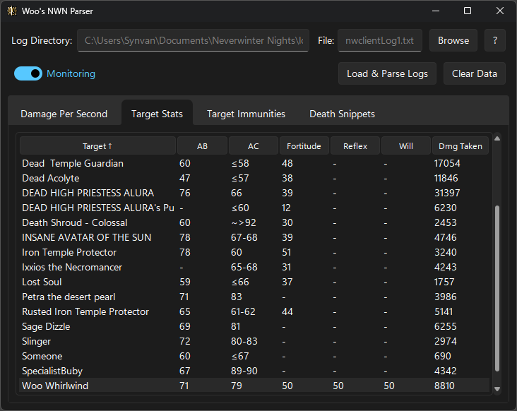
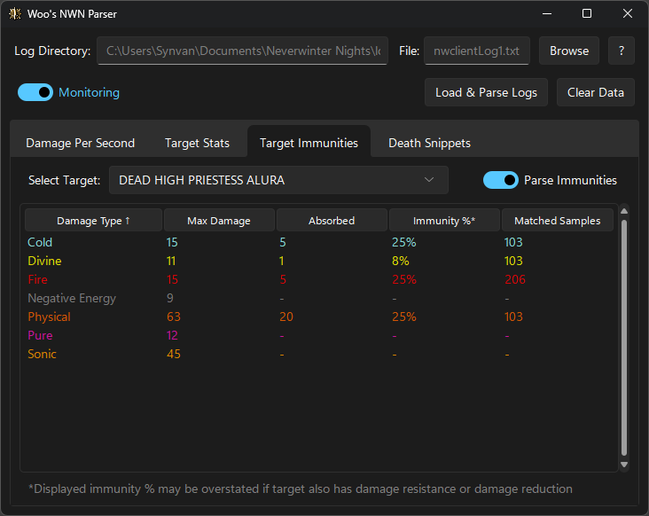
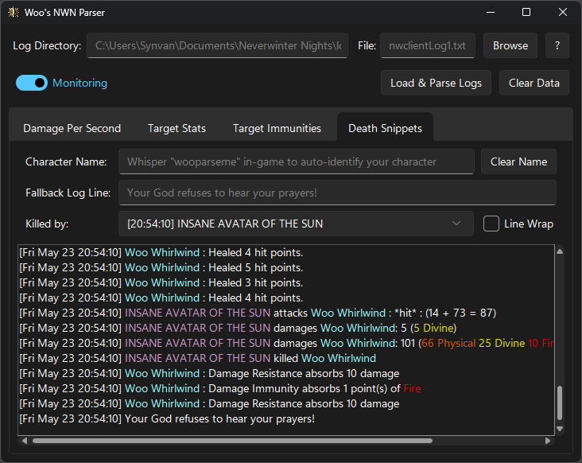

# Woo's NWN Parser

A real-time combat log parser and DPS analyzer for Neverwinter Nights. Track your damage output, analyze attack statistics, monitor enemy immunities, and optimize your combat performance.

## Screenshots

<!-- TODO: Add screenshots -->
**DPS Tracking:**



**Target Statistics:**



**Immunity Analysis:**



**Death Snippets:**



## Features

### Core Functionality
- **Real-time DPS Tracking** - Monitor damage output per second for all characters
- **Target Statistics** - Track enemies AB (Attack Bonus), AC (Armor Class), and Saves
- **Immunity Detection** - Automatically detect and calculate damage immunities
- **Death Snippets** - View last events leading to your character's death
- **Historic Log Analysis** - Analyze past combat logs for performance insights

### Advanced Features
- **Multi-Character Support** - Track all party members simultaneously
- **Damage Type Breakdown** - Detailed analysis by damage type (Physical, Fire, Cold, etc.)
- **Hit Rate Analysis** - Track attack hit rates per character
- **First Timestamp Modes** - Track globally from first character action or isolate by character
- **Target Filtering** - Focus analysis on specific enemies

### Technical Features
- **Automatic Truncation Detection** - Handles game restarts and log file resets
- **Immunity Queuing** - Conservative matching of damage and immunity events
- **Responsive Monitoring Pipeline** - Log reading/parsing runs in the background to keep UI smooth during heavy combat
- **Thread-Safe In-Memory Storage** - Concurrent data access without conflicts

## Quick Start

### Installation

#### Option 1: Download Pre-built Executable
1. Download the latest `WoosNwnParser.exe` from [Releases](../../releases)
2. Place in any folder
3. Run `WoosNwnParser.exe`
4. The app will automatically find your NWN log files

#### Option 2: Run from Source
```bash
# Clone the repository
git clone https://github.com/synvanalt/woos-nwn-parser.git
cd woos-nwn-parser

# Create virtual environment
python -m venv venv
venv\Scripts\activate  # On Windows

# Install dependencies
pip install -r requirements.txt

# Run the application
python -m app
```

### Configuration

The parser works out-of-the-box with default NWN installations. If needed:

- **Enable NWN Log Output**: `Game Options` → `Game` → `Game Log Chat All` → Enable
- **Log Directory**: Defaults to `%USERPROFILE%\Documents\Neverwinter Nights\logs`
- **Target Filter**: Optional - filter to show damage dealt to a specific target only
- **Immunity Parsing**: Toggle parsing of immunity events (enabled by default, and remembered between launches)
- **DPS First Timestamp Mode**: Choose between `Per Character` (default) or `Global` first timestamp tracking

## User Guide

### Understanding DPS Tracking

**Per Character Mode**
- Each character's DPS is calculated from their first damage event to the last damage event by any character
- Best for compensating for variance in start time across party members
- Shows different "character time" for each member

**Global Mode**
- All characters' DPS is calculated from the earliest damage event (by any character) to the last damage event (by any character)
- Best for comparing party members across the same time period
- Shows unified timeline for all characters

Both modes use the same last timestamp (the most recent damage dealt by any character) – the only difference is the start time used for calculations.

### Death Snippets Panel

- **Server-agnostic death tracking**
  - Auto-identify your character by whispering `wooparseme` in game
  - Once identified, death snippets are captured from `<Opponent> killed <CharacterName>`
- **Fallback matching**
  - If character name is unknown, `Fallback Log Line` is used as a trigger (editable in the panel)
  - If you edit `Fallback Log Line`, the app remembers it on next startup

### Reading Target Statistics

**AC (Armor Class)**
- Shows estimated AC based on attack rolls
- Format: `AC: 45` (exact) or `AC: 45-48` (range)
- Natural 1 misses and natural 20 hits are excluded from calculations
- Limitation: Inaccurate estimation for targets with `Epic Dodge` feat (`~` symbol is added to indicate such cases)

**AB (Attack Bonus)**
- Shows most common attack bonus (filters out temporary buffs)
- Format: `AB: 25` or `AB: -` (unknown)
- Uses mode (most frequent value) to represent typical AB

**Saves**
- Tracks Fortitude, Reflex, and Will saves
- Shows highest detected value for each

### Immunity Analysis

**Immunity Percentage**
- Automatically calculated from damage and absorption
- Shows as `Fire: 50%`, `Cold: 75%`, etc.
- Uses reverse calculation of NWN damage reduction formula, with a closest-match fallback when no exact reverse solution exists
- Limitation: Target with additional damage resistance may show inaccurate immunity percentage since resistance is unaccounted for

**Max Values**
- `Max Damage`: Highest damage of this type dealt to target
- `Absorbed`: Highest immunity points absorbed

## Architecture

### Project Structure

```
woos-nwn-parser/
├── app/                           # Main application code
│   ├── __init__.py
│   ├── __main__.py                # Entry point
│   ├── constants.py               # Shared constants (damage type palette)
│   ├── models.py                  # Data models
│   ├── parser.py                  # Log parsing logic
│   ├── storage.py                 # Data storage and queries
│   ├── monitor.py                 # File monitoring and rotation
│   ├── settings.py                # User settings persistence
│   ├── utils.py                   # Utility functions
│   ├── assets/                    # Application resources
│   ├── services/
│   │   ├── __init__.py
│   │   ├── dps_service.py         # DPS calculations
│   │   ├── event_ingestion.py     # Shared parsed-event normalization
│   │   ├── immunity_matcher.py    # Shared damage/immunity correlation
│   │   └── queue_processor.py     # Live queue draining and batching
│   └── ui/
│       ├── __init__.py
│       ├── main_window.py         # Main application window
│       ├── formatters.py          # Data formatting utilities
│       ├── window_style.py        # Window styling helpers
│       └── widgets/               # UI components
│           ├── __init__.py
│           ├── dps_panel.py
│           ├── target_stats_panel.py
│           ├── immunity_panel.py
│           ├── death_snippet_panel.py
│           ├── debug_console_panel.py
│           └── sorted_treeview.py
├── tests/                         # Test suite
│   ├── unit/                      # Unit tests
│   ├── integration/               # Integration tests
│   ├── e2e/                       # End-to-end tests
│   └── fixtures/                  # Test data
├── docs/                          # Documentation
├── WoosNwnParser-onedir.spec      # PyInstaller build spec - one directory
├── WoosNwnParser-onefile.spec     # PyInstaller build spec - one file
├── requirements.txt
├── requirements-dev.txt
├── CHANGELOG.md
└── README.md
```

### Key Components

**LogParser** (`parser.py`)
- Parses NWN combat log lines using regex patterns
- Extracts damage, attacks, saves, immunity, and death snippet events
- Supports player filtering and immunity parsing toggles

**DataStore** (`storage.py`)
- Thread-safe in-memory session storage
- Tracks damage events, attacks, DPS data, and immunities
- Owns target-stat aggregation (AC/AB/Saves)
- Provides query methods for UI components

**LogDirectoryMonitor** (`monitor.py`)
- Watches NWN logs directory for changes
- Handles log rotation (nwclientLog1.txt → nwclientLog2.txt, etc.)
- Detects file truncation from game restarts
- Uses bounded per-poll parsing to avoid long blocking reads when backlog grows

**Settings Persistence** (`settings.py`)
- Loads and saves user preferences used across app restarts
- Persists selected log directory, Death Snippets fallback log line, and the `Parse Immunities` toggle
- Settings are saved at `%LOCALAPPDATA%\WoosNwnParser\settings.json`

**QueueProcessor** (`services/queue_processor.py`)
- Drains the live parser queue in bounded batches
- Delegates parsed-event normalization to the shared ingestion engine
- Aggregates deduplicated UI refresh targets and side events into the drain result
- Manages periodic cleanup of stale immunity queue entries

**ImmunityMatcher** (`services/immunity_matcher.py`)
- Shares immunity matching logic between live monitoring and file import paths
- Conservatively pairs immunity lines with nearby damage observations by target, damage type, timestamp, and line number
- Keeps unmatched damage/immunity observations in bounded queues and prunes stale entries

**EventIngestionEngine** (`services/event_ingestion.py`)
- Converts parsed damage, attack, save, immunity, and death-related events into normalized store mutations and side events
- Owns the transient immunity-matching state used by both live monitoring and historic import
- Keeps live queue processing and import payload generation aligned through one shared normalization path

**DPSCalculationService** (`services/dps_service.py`)
- Calculates DPS with configurable time tracking modes
- Supports target filtering
- Provides damage type breakdowns

**WoosNwnParserApp** (`ui/main_window.py`)
- Orchestrates parser, storage, monitor, and queue processor wiring
- Keeps live monitoring responsive by running log read/parse work in a background worker thread
- Runs "Load & Parse Logs" background import workflow with modal progress + abort
- Keeps debug console hidden by default and reveals it through the DPS-tab click gesture

**DeathSnippetPanel** (`ui/widgets/death_snippet_panel.py`)
- Displays death-context snippets with a `Killed by:` dropdown (newest first)
- Supports character auto-identification from whisper token and runtime fallback log-line configuration
- Colors character names, damage type tokens and adjacent damage values using game color palette

## Development

### Prerequisites

- Python 3.12 or higher
- Windows 10/11 (for the full UI experience)
- Neverwinter Nights (Enhanced Edition)

### Setting Up Development Environment

```bash
# Clone repository
git clone https://github.com/yourusername/woos-nwn-parser.git
cd woos-nwn-parser

# Create virtual environment
python -m venv venv
venv\Scripts\activate

# Install dependencies
pip install -r requirements.txt

# Install development dependencies
pip install pytest pytest-cov

# Run application
python -m app
```

### Running Tests

```bash
# Install test dependencies
pip install pytest pytest-cov

# Run all tests
pytest tests/unit tests/integration tests/e2e

# Run with coverage report
pytest tests/unit tests/integration tests/e2e --cov=app --cov-report=html

# Run specific test file
pytest tests/unit/test_parser.py -v

# Run tests matching a pattern
pytest -k "damage" -v
```

### Building Executable

The project uses [PyInstaller](https://pyinstaller.org/) for creating standalone executables:

```bash
# Install PyInstaller
pip install pyinstaller

# Build executable
pyinstaller --clean WoosNwnParser-onefile.spec	# Single file approach
pyinstaller --clean WoosNwnParser-onedir.spec	# Multiple files in a directory approach
```

## Requirements

### Runtime Dependencies

```
tkinter (included with Python)
sv-ttk>=2.0.0        # Dark theme support
```

### Development Dependencies

```
pytest>=7.0.0
pytest-cov>=4.0.0
pyinstaller>=6.17.0		# For building executable
```

## Troubleshooting

### Parser Not Detecting Logs

**Issue**: Parser doesn't find NWN log files

**Solutions**:
- Verify NWN is installed and has been run at least once
- Check logs directory: `%USERPROFILE%\Documents\Neverwinter Nights\logs`
- Ensure combat logging is enabled in NWN (it's off by default):
	- `Game Options` → `Game` → `Game Log Chat All` → Enable
- Check Debug Console panel for error messages

### No DPS Showing

**Issue**: Combat events parsed but no DPS displayed

**Solutions**:
- Ensure you've dealt damage (attacks alone won't show DPS)
- Check that the correct target is selected
- Verify first timestamp mode matches your needs (`Per Character` vs `Global`)
- Clear data and restart if needed (`Reset Data` button)

## Acknowledgments

- Built for the NWN:EE [ADOH](https://www.adawnofheroes.org/) community
- Uses [sv-ttk](https://github.com/rdbende/Sun-Valley-ttk-theme) for modern dark theme

## Links

- **Repository**: [GitHub](https://github.com/yourusername/woos-nwn-parser)
- **Issues**: [Bug Reports](https://github.com/yourusername/woos-nwn-parser/issues)
- **Releases**: [Downloads](https://github.com/yourusername/woos-nwn-parser/releases)

